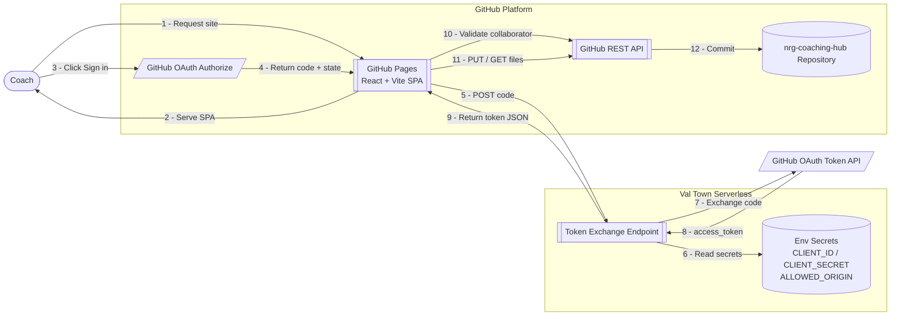
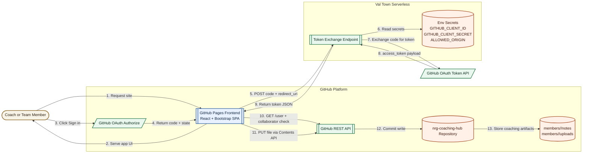

# Umais Coaching Hub

A per-coach team management portal hosted on GitHub Pages. Authenticated coaches manage their own team rosters, write meeting notes, and upload files — all committed directly to this repository using the GitHub Contents API. No backend database; Git is the data store.

## Live URLs

- GitHub repository: https://github.com/umais-developer/nrg-coaching-hub
- GitHub Pages (default): https://umais-developer.github.io/nrg-coaching-hub/
- Custom domain: https://nrg.umaissiddiqui.com/
- Val Town token exchange: https://umaisdeveloper--87af7930539211f1953dee650bb23af1.web.val.run

---

## High-level architecture



---

## Repository structure

```
src/
  config.js                        # Runtime OAuth + repo config
  main.jsx                         # Vite entry point
  App.jsx                          # Routes + providers
  styles.css
  components/
    AppNav.jsx                     # React-controlled nav dropdown
    PageHeader.jsx
    ProtectedRoute.jsx
  contexts/
    AuthContext.jsx                # Fetches + caches GitHub user
    TeamsContext.jsx               # Loads coach's teams.json, exposes updateTeams()
  lib/
    githubAuth.js                  # OAuth, Contents API, cache:no-store fetches
    teamColors.js                  # Team color palette + toSlug()
  pages/
    HomePage.jsx
    LoginPage.jsx
    RosterPage.jsx                 # Team roster with member detail cards + Edit buttons
    AddTeamPage.jsx                # Create a new team → commits teams.json
    AddMemberPage.jsx              # Add member with all fields → commits teams.json
    EditMemberPage.jsx             # Edit any member field → commits teams.json
    CoachNotesPage.jsx             # Save meeting notes per member
    DiscussionsPage.jsx            # Browse all saved notes across all coaches
    UploadsPage.jsx                # Upload files to repo
    WorkshopsPage.jsx
    ExportsPage.jsx                # Download CSV: summary, full roster, per-team
    ToolsSetupPage.jsx
coaches/
  <github-username>/
    teams.json                     # Each coach's team + member data (scoped by login)
public/
  404.html                         # GitHub Pages SPA redirect shim
  CNAME                            # Custom domain mapping
  login.html                       # OAuth callback bridge
serverless/
  token-exchange-valtown.ts        # Val Town token exchange source
```

---

## Per-coach data scoping

Every coach's data lives under `coaches/<github-username>/`. When a coach logs in, the app resolves their GitHub username and reads only their scoped files.

| Path | Purpose |
|---|---|
| `coaches/<username>/teams.json` | Team definitions and full member roster |
| `coaches/<username>/members/<slug>/notes/<date>_<ts>.txt` | Coaching notes per member |
| `coaches/<username>/members/<slug>/uploads/<ts>_<file>` | File uploads per member |

The `TeamsContext` auto-loads `coaches/<username>/teams.json` on sign-in. All team/member mutations use **optimistic updates** (`updateTeams()`) so changes appear instantly in the UI without a re-fetch.

---

## Member data model

Each entry in a team's `members` array supports these fields:

| Field | Type | Description |
|---|---|---|
| `name` | string | Display name |
| `slug` | string | URL-safe key, derived from name, never changes |
| `position` | string (optional) | Job title / role |
| `location` | string (optional) | City, state, or timezone |
| `workingHours` | string (optional) | e.g. `9AM – 5PM CST` |
| `inProgram` | `"Yes"` \| `"No"` | Program enrollment status |
| `aiKnowledge` | `"Beginner"` \| `"Medium"` \| `"Expert"` | AI proficiency level |

Fields not yet filled in are simply omitted from JSON — old members without new fields display cleanly and can be backfilled via **Edit Member**.

Example:
```json
{
  "name": "Jane Smith",
  "slug": "jane-smith",
  "position": "Sr. Software Engineer",
  "location": "Austin, TX",
  "workingHours": "9AM – 5PM CST",
  "inProgram": "Yes",
  "aiKnowledge": "Medium"
}
```

---

## Authentication and authorization

1. Any GitHub user can start OAuth sign-in.
2. After token exchange, the frontend calls `GET /user` to resolve the username.
3. Access is granted when **either**:
   - `user.login === repo owner` (parsed from `TARGET_REPO`), or
   - `GET /repos/{repo}/collaborators/{user}` returns `204`.
4. If validation fails the token is removed and the user is blocked.

Access control lives entirely in GitHub collaborator settings — no hardcoded usernames anywhere.

---

## Runtime configuration (`src/config.js`)

| Key | Description |
|---|---|
| `CLIENT_ID` | GitHub OAuth App client ID (public) |
| `TOKEN_EXCHANGE_URL` | Val Town (or other serverless) endpoint |
| `TARGET_REPO` | `owner/repo` that stores coaching data |
| `TARGET_BRANCH` | Branch to read/write (default `main`) |
| `OAUTH_SCOPE` | `public_repo` for public repos, `repo` for private |
| `OAUTH_CALLBACK_PATH` | Path of OAuth callback page (e.g. `/login.html`) |

---

## Key implementation patterns

### Optimistic state updates (no re-fetch after write)
`TeamsContext` exposes `updateTeams(newTeams)` which sets React state directly. After any successful GitHub Contents API write, pages call `updateTeams()` instead of re-fetching — changes appear in the UI the moment the commit succeeds.

### cache: no-store on all GitHub API reads
Every `fetch()` to `api.github.com` — both through `ghRequest()` in `githubAuth.js` and the direct fetch in `TeamsContext.load()` — uses `cache: "no-store"`. This prevents the browser from serving stale responses, which is critical for `getExistingFileSha()` (a stale SHA causes a 409 conflict on the next PUT).

### React-controlled nav dropdown
`AppNav` manages the Coach dropdown with React state (`dropdownOpen`) instead of Bootstrap's JS. Closes on: link click (`onClick`), outside click (document `mousedown` listener), and route change (`useEffect` on `location.pathname`). Fixes the common SPA issue where Bootstrap dropdowns stay open after client-side navigation.

### Notes path structure
Notes are saved by `CoachNotesPage` to `coaches/<coach>/members/<slug>/notes/<date>_<ts>.txt`. The `listMemberNoteFiles()` function in `githubAuth.js` searches the git tree for `^coaches/[^/]+/members/[^/]+/notes/.*\.txt$`. The `DiscussionsPage` extracts the member slug from path index `[3]` and coach username from index `[1]`.

---

## Pages and features

| Route | Auth | Description |
|---|---|---|
| `/` | No | Dashboard / home |
| `/team-roster` | No | All teams with member detail cards, Edit buttons |
| `/workshops` | No | Workshop schedule |
| `/tools-setup` | No | Tools and setup guide |
| `/coach-notes` | Yes | Write and save meeting notes |
| `/discussions` | Yes | Browse all saved notes, filter by member, preview inline |
| `/uploads` | Yes | Upload files to repo |
| `/add-team` | Yes | Create a new team |
| `/add-member` | Yes | Add a member with full profile fields |
| `/edit-member` | Yes | Edit any member (deep-linkable via `?slug=`) |
| `/exports` | Yes | Download CSV: team summary, full roster, per-team files |

---

## CSV exports

The **Exports** page generates downloads client-side from live context data — no server call needed.

| File | Contents |
|---|---|
| `nrg-team-summary.csv` | Team Name, Total Members + grand total row |
| `nrg-full-roster.csv` | Team, Name, Position, Location, Working Hours, In Program, AI Knowledge |
| `nrg-{team}.csv` × N | One file per team with member detail columns |

All files include a UTF-8 BOM for correct Excel rendering of special characters.

---

## Setup for a new instance

### Accounts needed
1. **GitHub** — repo hosting, Pages, OAuth App registration, collaborator management
2. **Val Town** — serverless token exchange (free tier sufficient)
3. **DNS provider** (optional) — if using a custom domain

### Setup sequence
1. Create a GitHub repo and push source.
2. Enable GitHub Pages (Settings → Pages → Deploy from branch `main`).
3. Register a GitHub OAuth App:
   - Homepage URL = final public URL
   - Callback URL = `https://<domain>/login.html`
4. Create a Val Town HTTP val with the token exchange code from `serverless/token-exchange-valtown.ts`.
5. Add Val Town env vars: `GITHUB_CLIENT_ID`, `GITHUB_CLIENT_SECRET`, `ALLOWED_ORIGIN`.
6. Update `src/config.js` with `CLIENT_ID`, `TOKEN_EXCHANGE_URL`, `TARGET_REPO`, etc.
7. Add collaborators in repo Settings → Collaborators.
8. Push. GitHub Actions builds and deploys automatically.

### Val Town token exchange env vars
| Var | Value |
|---|---|
| `GITHUB_CLIENT_ID` | OAuth App Client ID |
| `GITHUB_CLIENT_SECRET` | OAuth App Client Secret |
| `ALLOWED_ORIGIN` | Exact frontend origin, e.g. `https://nrg.umaissiddiqui.com` |

---

## Deployment flow

1. Push to `main`.
2. GitHub Actions runs `npm install` + `npm run build` (Vite).
3. Workflow deploys `dist/` to GitHub Pages.
4. Site serves updated SPA at the configured domain.

---

## Extensibility

### AI note generation
Add a "Generate Draft" button to Coach Notes that POSTs structured context (member, date, bullet points) to a new Val Town endpoint. Val Town calls an LLM API using a server-side secret and returns a draft. Populate the textarea, let the coach edit, then save as normal. The AI key stays server-side; existing auth/CORS patterns reuse unchanged.

### Richer content model
Move notes from plain `.txt` to Markdown with YAML frontmatter for easier parsing. Add JSON sidecar files for analytics. Use consistent naming for programmatic search.

### Workflow automation
Trigger GitHub Actions on new note commits for summaries, Slack notifications, or periodic coaching reports generated from repository content.

### Fine-grained access control
Expand `validateUserIsContributor` to check GitHub Teams membership instead of collaborator status, enabling team-based read/write separation.

---

## Operational checklist

Before releasing auth, domain, or API changes:

1. Pages URL responds with `200`.
2. OAuth callback URL matches deployed route exactly.
3. `ALLOWED_ORIGIN` in Val Town matches deployed origin exactly.
4. Sign-in succeeds; collaborator validation behaves as expected.
5. Save operation creates a commit in the target repo.
6. `getExistingFileSha()` returns the current SHA (not a cached stale one).


This repository hosts a GitHub Pages coaching portal where authenticated users can save notes and uploads directly into the repository using GitHub OAuth and the GitHub Contents API.

## Live URLs

- GitHub repository: https://github.com/umais-developer/nrg-coaching-hub
- GitHub Pages (default): https://umais-developer.github.io/nrg-coaching-hub/
- Custom domain (mapped): https://nrg.umaissiddiqui.com/
- Val Town token exchange endpoint: https://umaisdeveloper--87af7930539211f1953dee650bb23af1.web.val.run

## Setup for new teams (accounts + URLs)

Use this section if someone else wants to build the same architecture from scratch.

### Accounts they need to create

1. GitHub account
- URL: https://github.com/signup
- Needed for: repository hosting, GitHub Pages, OAuth App registration, collaborator management.

2. Val Town account
- URL: https://www.val.town
- Needed for: secure server-side token exchange endpoint (keeps client secret out of frontend).

3. Optional DNS/domain provider account (only if using a custom domain)
- Example providers: Cloudflare, Squarespace, GoDaddy, Namecheap.
- Needed for: CNAME/A record mapping to GitHub Pages.

### URLs they will use during setup

1. Create repository
- https://github.com/new

2. Configure GitHub Pages
- https://github.com/<owner>/<repo>/settings/pages

3. Register OAuth App
- https://github.com/settings/developers

4. Create Val Town HTTP endpoint
- https://www.val.town

5. Optional custom domain docs
- https://docs.github.com/en/pages/configuring-a-custom-domain-for-your-github-pages-site

### Minimal setup sequence

1. Create a GitHub repository and push frontend files.
2. Enable GitHub Pages on the repository.
3. Register a GitHub OAuth App with:
- Homepage URL = final public site URL.
- Authorization callback URL = final callback page (example: /login.html).
4. Create a Val Town HTTP val for token exchange.
5. Add Val Town secrets/env vars:
- GITHUB_CLIENT_ID
- GITHUB_CLIENT_SECRET
- ALLOWED_ORIGIN (exact frontend origin)
6. Update frontend runtime config:
- CLIENT_ID
- TOKEN_EXCHANGE_URL
- TARGET_REPO
- TARGET_BRANCH
- OAUTH_SCOPE
- OAUTH_CALLBACK_PATH
7. Test login, collaborator validation, and file save.

### Who can access after setup

Recommended policy in this repo:

1. Repo owner always allowed.
2. Other users must be added as collaborators in:
- https://github.com/<owner>/<repo>/settings/access

This keeps access control in GitHub settings instead of hardcoded usernames.

## High-level architecture



## Components

1. React frontend on GitHub Pages
- Application source in src/.
- Routing handled with HashRouter for GitHub Pages compatibility.
- Responsive UI built with Bootstrap.
- OAuth callback bridge at public/login.html.

2. GitHub authentication and API client
- Frontend auth helper in src/lib/githubAuth.js.
- Runtime config in src/config.js.
- Handles OAuth state generation and validation.
- Exchanges OAuth code for token via Val Town.
- Uses token in sessionStorage for session-scoped auth.
- Writes files to the repository with GitHub Contents API.

3. Serverless token exchange (Val Town)
- Receives POST payload with code and redirect_uri.
- Uses GITHUB_CLIENT_ID and GITHUB_CLIENT_SECRET from Val Town env vars.
- Restricts CORS using ALLOWED_ORIGIN.
- Returns token payload to frontend.

4. Repository-backed content storage
- Notes and uploads are committed directly to Git.
- Gives full history, auditability, and rollback via normal Git commits.

## Authentication and authorization model

Current access behavior:

1. Any user can start GitHub OAuth login.
2. After token exchange, frontend validates authorization against the target repo.
3. Access is granted when either condition is true:
- User login equals the repo owner parsed from TARGET_REPO.
- User is a collaborator on the target repo (GitHub collaborator check endpoint returns 204).
4. If validation fails:
- Token is removed from sessionStorage.
- User is blocked with an access-denied error.

This means access control is managed through GitHub collaborator settings instead of hardcoded usernames.

## Runtime configuration

Frontend config keys used by the app:

- CLIENT_ID
- TOKEN_EXCHANGE_URL
- TARGET_REPO
- TARGET_BRANCH
- OAUTH_SCOPE
- OAUTH_CALLBACK_PATH

When changing domain or callback values, update OAuth app settings, serverless CORS allowed origin, and frontend config together.

Current source of truth: src/config.js.

## Data layout in repo

Current persisted paths:

- members/<member-slug>/notes/<meeting-date>_<timestamp>.txt
- members/<member-slug>/uploads/<timestamp>_<filename>

## Deployment flow

1. Push updates to main.
2. GitHub Actions installs dependencies and builds the app (npm run build).
3. Workflow deploys dist/ to GitHub Pages.
4. Site serves updated React frontend.
5. OAuth and token exchange continue to run against configured callback and Val Town endpoint.

## Extensibility guide

### 1) AI note generator on coach-notes page

Recommended pattern:

1. Add a "Generate Draft" UI action in coach-notes page.
2. Send structured context (member, team, meeting date, bullet points, goals, blockers) to a new Val Town endpoint.
3. Val Town calls an LLM provider using a server-side secret (for example AI_API_KEY).
4. Return structured draft text (summary, action items, follow-ups).
5. Populate the notes textarea, allow coach edits, then save to GitHub as normal.

Why this is preferred:
- AI API key stays server-side.
- Existing CORS and auth patterns can be reused.
- Generation can be logged/rate-limited centrally.

### 2) Fine-grained access controls

Potential expansions:

- Team-based rules: allow only collaborators in specific teams to access specific pages.
- Read vs write separation by page.
- Repository or path-level authorization checks before saves.

### 3) Better content model

Options:

- Move note format from plain text to Markdown with frontmatter.
- Store richer metadata JSON sidecars for analytics.
- Add consistent file naming schema for easier search.

### 4) Workflow automation

Options:

- Trigger GitHub Actions on new notes for summaries or notifications.
- Auto-open discussion issues from coaching notes.
- Generate periodic coaching reports from repository content.

### 5) Platform flexibility

Current serverless host is Val Town, but the same token exchange pattern can be moved to:

- Cloudflare Workers
- Vercel Functions
- Netlify Functions

### 6) Reliability and observability

Recommended next additions:

- Request IDs and structured logs in serverless responses.
- Basic abuse controls (rate limits, payload size checks).
- Automated health checks for Pages URL, OAuth callback, and token exchange endpoint.

## Operational checklist for future changes

Before releasing auth, domain, or API changes:

1. Confirm Pages URL responds with 200.
2. Confirm OAuth callback matches deployed route exactly.
3. Confirm ALLOWED_ORIGIN matches deployed origin exactly.
4. Confirm login succeeds and collaborator validation behaves as expected.
5. Confirm save operation creates a commit in target repo.
6. Confirm frontend config cache-busting is updated when required.
