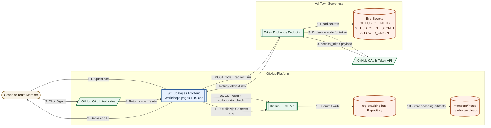

# NRG Coaching Hub Architecture

This repository hosts a GitHub Pages coaching portal where authenticated users can save notes and uploads directly into the repository using GitHub OAuth and the GitHub Contents API.

## Live URLs

- GitHub repository: https://github.com/umais-developer/nrg-coaching-hub
- GitHub Pages (default): https://umais-developer.github.io/nrg-coaching-hub/
- Custom domain (mapped): https://nrg.umaissiddiqui.com/
- Val Town token exchange endpoint: https://umaisdeveloper--87af7930539211f1953dee650bb23af1.web.val.run

## Setup for new teams (accounts + URLs)

Use this section if someone else wants to build the same architecture from scratch.

### Accounts they need to create

1. GitHub account
- URL: https://github.com/signup
- Needed for: repository hosting, GitHub Pages, OAuth App registration, collaborator management.

2. Val Town account
- URL: https://www.val.town
- Needed for: secure server-side token exchange endpoint (keeps client secret out of frontend).

3. Optional DNS/domain provider account (only if using a custom domain)
- Example providers: Cloudflare, Squarespace, GoDaddy, Namecheap.
- Needed for: CNAME/A record mapping to GitHub Pages.

### URLs they will use during setup

1. Create repository
- https://github.com/new

2. Configure GitHub Pages
- https://github.com/<owner>/<repo>/settings/pages

3. Register OAuth App
- https://github.com/settings/developers

4. Create Val Town HTTP endpoint
- https://www.val.town

5. Optional custom domain docs
- https://docs.github.com/en/pages/configuring-a-custom-domain-for-your-github-pages-site

### Minimal setup sequence

1. Create a GitHub repository and push frontend files.
2. Enable GitHub Pages on the repository.
3. Register a GitHub OAuth App with:
- Homepage URL = final public site URL.
- Authorization callback URL = final callback page (example: /login.html).
4. Create a Val Town HTTP val for token exchange.
5. Add Val Town secrets/env vars:
- GITHUB_CLIENT_ID
- GITHUB_CLIENT_SECRET
- ALLOWED_ORIGIN (exact frontend origin)
6. Update frontend runtime config:
- CLIENT_ID
- TOKEN_EXCHANGE_URL
- TARGET_REPO
- TARGET_BRANCH
- OAUTH_SCOPE
- OAUTH_CALLBACK_PATH
7. Test login, collaborator validation, and file save.

### Who can access after setup

Recommended policy in this repo:

1. Repo owner always allowed.
2. Other users must be added as collaborators in:
- https://github.com/<owner>/<repo>/settings/access

This keeps access control in GitHub settings instead of hardcoded usernames.

## High-level architecture

## Components

1. Static frontend on GitHub Pages
- Multi-page site under Workshops.
- Shared runtime configuration from assets/js/config.js.
- OAuth callback route at /login.html.

2. GitHub authentication and API client
- Frontend auth helper in assets/js/github-auth.js.
- Handles OAuth state generation and validation.
- Exchanges OAuth code for token via Val Town.
- Uses token in sessionStorage for session-scoped auth.
- Writes files to the repository with GitHub Contents API.

3. Serverless token exchange (Val Town)
- Receives POST payload with code and redirect_uri.
- Uses GITHUB_CLIENT_ID and GITHUB_CLIENT_SECRET from Val Town env vars.
- Restricts CORS using ALLOWED_ORIGIN.
- Returns token payload to frontend.

4. Repository-backed content storage
- Notes and uploads are committed directly to Git.
- Gives full history, auditability, and rollback via normal Git commits.

## Authentication and authorization model

Current access behavior:

1. Any user can start GitHub OAuth login.
2. After token exchange, frontend validates authorization against the target repo.
3. Access is granted when either condition is true:
- User login equals the repo owner parsed from TARGET_REPO.
- User is a collaborator on the target repo (GitHub collaborator check endpoint returns 204).
4. If validation fails:
- Token is removed from sessionStorage.
- User is blocked with an access-denied error.

This means access control is managed through GitHub collaborator settings instead of hardcoded usernames.

## Runtime configuration

Frontend config keys used by the app:

- CLIENT_ID
- TOKEN_EXCHANGE_URL
- TARGET_REPO
- TARGET_BRANCH
- OAUTH_SCOPE
- OAUTH_CALLBACK_PATH

When changing domain or callback values, update OAuth app settings, serverless CORS allowed origin, and frontend config together, then cache-bust config.js includes.

## Data layout in repo

Current persisted paths:

- members/<member-slug>/notes/<meeting-date>_<timestamp>.txt
- members/<member-slug>/uploads/<timestamp>_<filename>

## Deployment flow

1. Push updates to main.
2. GitHub Pages rebuilds from repository source.
3. Site serves updated frontend.
4. OAuth and token exchange continue to run against configured callback and Val Town endpoint.

## Extensibility guide

### 1) AI note generator on coach-notes page

Recommended pattern:

1. Add a "Generate Draft" UI action in coach-notes page.
2. Send structured context (member, team, meeting date, bullet points, goals, blockers) to a new Val Town endpoint.
3. Val Town calls an LLM provider using a server-side secret (for example AI_API_KEY).
4. Return structured draft text (summary, action items, follow-ups).
5. Populate the notes textarea, allow coach edits, then save to GitHub as normal.

Why this is preferred:
- AI API key stays server-side.
- Existing CORS and auth patterns can be reused.
- Generation can be logged/rate-limited centrally.

### 2) Fine-grained access controls

Potential expansions:

- Team-based rules: allow only collaborators in specific teams to access specific pages.
- Read vs write separation by page.
- Repository or path-level authorization checks before saves.

### 3) Better content model

Options:

- Move note format from plain text to Markdown with frontmatter.
- Store richer metadata JSON sidecars for analytics.
- Add consistent file naming schema for easier search.

### 4) Workflow automation

Options:

- Trigger GitHub Actions on new notes for summaries or notifications.
- Auto-open discussion issues from coaching notes.
- Generate periodic coaching reports from repository content.

### 5) Platform flexibility

Current serverless host is Val Town, but the same token exchange pattern can be moved to:

- Cloudflare Workers
- Vercel Functions
- Netlify Functions

### 6) Reliability and observability

Recommended next additions:

- Request IDs and structured logs in serverless responses.
- Basic abuse controls (rate limits, payload size checks).
- Automated health checks for Pages URL, OAuth callback, and token exchange endpoint.

## Operational checklist for future changes

Before releasing auth, domain, or API changes:

1. Confirm Pages URL responds with 200.
2. Confirm OAuth callback matches deployed route exactly.
3. Confirm ALLOWED_ORIGIN matches deployed origin exactly.
4. Confirm login succeeds and collaborator validation behaves as expected.
5. Confirm save operation creates a commit in target repo.
6. Confirm frontend config cache-busting is updated when required.
