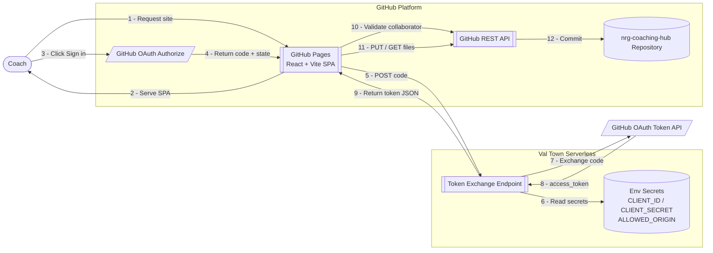

# Umais Coaching Hub

A per-coach team management portal hosted on GitHub Pages. Authenticated coaches manage their own cohorts and team rosters, write meeting notes, and upload files — all committed directly to this repository using the GitHub Contents API. No backend database; Git is the data store.

Teams are grouped into **cohorts** — a program run with a start and end date (e.g. "Pod 1A-US", May 18 – Aug 7 2026). Each cohort carries its own workshop schedule, and the roster, meeting notes, and discussions can all be filtered by cohort.

## Live URLs

- GitHub repository: https://github.com/umais-developer/nrg-coaching-hub
- GitHub Pages (default): https://umais-developer.github.io/nrg-coaching-hub/
- Custom domain: https://nrg.umaissiddiqui.com/
- Val Town token exchange: https://umaisdeveloper--87af7930539211f1953dee650bb23af1.web.val.run

---

## High-level architecture


```mermaid
flowchart LR
  U([Coach])

  subgraph GH[GitHub Platform]
    P[[GitHub Pages\nReact + Vite SPA]]
    OA[/GitHub OAuth Authorize/]
    API[[GitHub REST API]]
    REPO[(nrg-coaching-hub Repository)]
  end

  subgraph VT[Val Town Serverless]
    EX[[Token Exchange Endpoint]]
    SEC[(Env Secrets\nCLIENT_ID / CLIENT_SECRET\nALLOWED_ORIGIN)]
  end

  TOK[/GitHub OAuth Token API/]

  U -->|1 - Request site| P
  P -->|2 - Serve SPA| U
  U -->|3 - Click Sign in| OA
  OA -->|4 - Return code + state| P
  P -->|5 - POST code| EX
  EX -->|6 - Read secrets| SEC
  EX -->|7 - Exchange code| TOK
  TOK -->|8 - access_token| EX
  EX -->|9 - Return token JSON| P
  P -->|10 - Validate collaborator| API
  P -->|11 - PUT / GET files| API
  API -->|12 - Commit| REPO
```

---

## Repository structure

```
src/
  config.js                        # Runtime OAuth + repo config
  main.jsx                         # Vite entry point
  App.jsx                          # Routes + providers
  styles.css
  components/
    AppNav.jsx                     # React-controlled nav dropdown
    PageHeader.jsx
    ProtectedRoute.jsx
  contexts/
    AuthContext.jsx                # Fetches + caches GitHub user
    TeamsContext.jsx               # Loads cohorts + teams, exposes saveAll()
  lib/
    githubAuth.js                  # OAuth, Contents API, cache:no-store, path boundary
    teamColors.js                  # Team color palette + toSlug()
    cohorts.js                     # Cohort dates, status, grouping, schedule helpers
  pages/
    HomePage.jsx
    LoginPage.jsx
    RosterPage.jsx                 # Teams grouped by cohort, collapsible + filterable
    CohortsPage.jsx                # Create / edit / delete cohorts
    AddTeamPage.jsx                # Create a new team → commits teams.json
    EditTeamPage.jsx               # Edit team name, color, cohort → commits teams.json
    AddMemberPage.jsx              # Add member with all fields → commits teams.json
    EditMemberPage.jsx             # Edit any member field → commits teams.json
    CoachNotesPage.jsx             # Save meeting notes, filter by cohort + team
    DiscussionsPage.jsx            # Browse your own saved notes (per-coach scoped)
    UploadsPage.jsx                # Upload files into your own coach folder
    WorkshopsPage.jsx              # Per-cohort workshop schedule
    ExportsPage.jsx                # Download CSV: summary, full roster, per-team
    ToolsSetupPage.jsx
coaches/
  <github-username>/
    teams.json                     # Cohorts + teams + members (scoped by login)
    schedule.json                  # Workshop schedule per cohort
public/
  404.html                         # GitHub Pages SPA redirect shim
  CNAME                            # Custom domain mapping
  login.html                       # OAuth callback bridge
serverless/
  token-exchange-valtown.ts        # Val Town token exchange source
```

---

## Per-coach data scoping

Every coach's data lives under `coaches/<github-username>/`. When a coach logs in, the app resolves their GitHub username and reads only their scoped files.

| Path | Purpose |
|---|---|
| `coaches/<username>/teams.json` | Cohorts, team definitions, and full member roster |
| `coaches/<username>/schedule.json` | Workshop schedule, keyed by cohort slug |
| `coaches/<username>/members/<slug>/notes/<date>_<ts>.txt` | Coaching notes per member |
| `coaches/<username>/members/<slug>/uploads/<ts>_<file>` | File uploads per member |

The `TeamsContext` auto-loads `coaches/<username>/teams.json` on sign-in. All team/member/cohort mutations go through `saveAll()` and use **optimistic updates** so changes appear instantly in the UI without a re-fetch.

### The per-coach boundary is enforced, not just conventional

Coaching notes are private to the coaching relationship that produced them. A coach may only read and write inside their own `coaches/<login>/` folder:

- `assertOwnedPath(repoPath)` in `githubAuth.js` checks the `coaches/<login>/` prefix and rejects traversal (`..`), absolute paths, backslashes, and prefix-confusion (`umais-dev-evil` does not match `umais-dev`).
- It is applied in **`putFile()`**, through which every write in the app passes, and in **`readTextFile()`**, the point where note text is actually exposed. Enforcing at these two chokepoints means a new caller cannot accidentally bypass it.
- `listMemberNoteFiles()` returns only the signed-in coach's notes. It previously globbed `coaches/*/members/*/notes/*.txt` across every coach, which let any coach read every other coach's notes — see git history for the fix.
- The signed-in login is cached in `sessionStorage` (`coaching_gh_login`) so the data layer can check ownership without depending on React state, and is cleared on logout.

> **Scope of this control.** This is a client-side boundary. All coaches are collaborators on the same repository, so anyone with repo access can still read any file directly via the GitHub API or the repo UI — and if the repo is public, so can anyone else. The boundary stops the app from surfacing another coach's notes and prevents cross-coach writes. If notes must be genuinely confidential, use a private repo or the note encryption below.

---

## Note encryption (optional, off by default)

Coaching note **bodies** can be encrypted so that the text is unreadable even to someone reading the repository directly. This is the one control here that survives the repo being public.

### The key never reaches the browser

The frontend is a static bundle on GitHub Pages — anything shipped in it is public, and `window.APP_CONFIG` is writable from the browser console. **A key delivered to the browser is a published key.** So the browser never gets one:

```
Browser                          Val Town function
  |-- path + GitHub token ------------->|
  |                          verify caller via GET /user
  |                          confirm repo collaborator
  |                          authorize the path server-side
  |                          decrypt with NOTE_ENCRYPTION_KEY
  |<---------------- plaintext ---------|
```

`NOTE_ENCRYPTION_KEY` lives only in Val Town env. It is never in `src/config.js`, never in the bundle, and must never be a `VITE_`-prefixed build secret — Vite inlines those into `dist/assets/*.js` verbatim, which publishes them.

**CORS is not authentication.** `Access-Control-Allow-Origin` is enforced by browsers; `curl` ignores it. Every privileged route verifies the caller's GitHub token server-side. Do not remove those checks on the assumption that CORS restricts callers.

### File format — body encrypted, headers readable

```
Coach: umais-developer          <- readable
Member: Aaron Medina            <- readable
Team: Team Brad                 <- readable
Cohort: POD 1A - US             <- readable
Visibility: shared              <- readable, gates member access
Meeting Date: 2026-08-12        <- readable
Saved At: 2026-08-12T15:43:51Z  <- readable
Encryption: v1                  <- absent means legacy plaintext
                                <- blank line, structural separator
Discussion Notes:
<base64: iv[12] || AES-256-GCM ciphertext+tag>
```

Headers stay readable so `roles.js` can filter by member and visibility **without decrypting**, and so a note stays identifiable if the key is ever lost. A note with no `Encryption:` header is legacy plaintext and renders directly — which is why no migration is needed.

### What it does NOT hide

| Still public | Example |
|---|---|
| File paths | `coaches/umais-developer/members/aaron-medina/notes/2026-08-12_*.txt` |
| Commit messages | `Add coaching note for Aaron Medina on 2026-08-12` |
| Note headers | member name, team, cohort, date, visibility |
| `teams.json` | every member's name, position, location, AI-knowledge rating |

So *what was said* becomes private; *that a session happened, with whom, and when* stays public. A private repository is still the broader fix, and the two are complementary.

### Val Town routes

| Route | Body | Purpose |
|---|---|---|
| `POST /` | `{ code, redirect_uri }` | OAuth token exchange (unchanged) |
| `POST /encrypt` | `{ token, path, plaintext }` | Returns `{ ciphertext }` |
| `POST /decrypt` | `{ token, path, ciphertext }` | Returns `{ plaintext }` |

Both crypto routes run the same gate: resolve the caller via `GET /user` → confirm collaborator → authorize the path (a server-side mirror of `assertOwnedPath`, since a client-side check proves nothing to a server) → rate limit → audit log. Roles come from `coaches/users.json` read server-side, never from a client-supplied claim.

**Members never receive private notes.** For a member, `/decrypt` fetches the note, parses `Visibility` itself, and returns 403 for a private one. The rule lives on the server, not in the browser.

The val receives users' GitHub tokens, which it never did before. It uses them only for verification and **must never log them** — the audit log records login, path, action, and outcome, never the token or the plaintext.

### Enabling it

**Step-by-step guide with exact values: [docs/ENABLING-NOTE-ENCRYPTION.md](docs/ENABLING-NOTE-ENCRYPTION.md)**

In short:

1. Generate a key — `node -e "console.log(require('crypto').randomBytes(32).toString('base64'))"` — and **back it up**. Losing it makes every encrypted note unrecoverable.
2. Deploy the updated `serverless/token-exchange-valtown.ts` to the val, with env vars `NOTE_ENCRYPTION_KEY` and `TARGET_REPO` added.
3. Confirm `POST /encrypt` with an empty body returns `{"error":"Missing token"}` — if it returns `Missing code or redirect_uri`, the old code is still deployed.
4. Only then set `NOTE_ENCRYPTION: true` in `src/config.js` and deploy.

Order matters. Enabling the flag before the val is ready makes note saving fail — deliberately, since it must never silently fall back to writing plaintext into a public repo.

Until all three steps are complete the app behaves exactly as before, saving notes in plaintext.

---

## Cohort and team data model

`coaches/<username>/teams.json` holds two sibling keys. They live in one file so a
single commit updates both — cohorts and teams can never drift out of sync, and
there is only one blob SHA to conflict on.

```json
{
  "cohorts": [
    {
      "name": "Pod 1A-US",
      "slug": "pod-1a-us",
      "startDate": "2026-05-18",
      "endDate": "2026-08-07",
      "color": "indigo"
    }
  ],
  "teams": [
    {
      "name": "Team Brad",
      "slug": "team-brad",
      "color": "teal",
      "cohort": "pod-1a-us",
      "members": [ /* ... */ ]
    }
  ]
}
```

| Field | Type | Description |
|---|---|---|
| `name` | string | Display name, e.g. `Pod 1A-US` |
| `slug` | string | `toSlug(name)`; immutable identity |
| `startDate` / `endDate` | `yyyy-mm-dd` | Calendar dates from `<input type="date">` |
| `color` | palette value | One of `TEAM_COLOR_OPTIONS` |

A team's `cohort` field holds a cohort slug. **The key is omitted entirely when
unassigned** — matching how optional member fields are stored. Teams with no
cohort, or pointing at a deleted one, group under a synthetic **Unknown** bucket
(`UNKNOWN_COHORT` in `cohorts.js`); it is a constant, never a stored record. This
is why existing data needed no migration when cohorts were introduced.

Deleting a cohort is **blocked while any team still references it**, and the
error names the blocking teams. Nothing is ever silently orphaned.

### Dates and timezones (important)

Cohort dates are calendar dates, not instants, and two different rules apply:

- **Rendering — never `new Date("2026-05-18")`.** That parses as UTC midnight and
  renders as May 17 anywhere west of Greenwich. `cohorts.js` splits the string and
  builds a local date, so a cohort reads identically for coaches in Chicago,
  Mexico City, and Kyiv.
- **Status — "today" means US Central.** `getCohortStatus()` compares against
  `todayInCST()` (`America/Chicago`, which handles the CST/CDT switch), so a cohort
  flips `upcoming` → `active` → `completed` at the same moment for every coach
  rather than at each viewer's local midnight. Because ISO `yyyy-mm-dd` sorts
  lexicographically, the comparison is a plain string compare — no Date math, no
  DST edge cases.

Note filenames carry real UTC timestamps and are deliberately left alone.

---

## Workshop schedules (per cohort)

Every cohort runs its own sessions. `coaches/<username>/schedule.json`:

```json
{
  "schedules": {
    "pod-1a-us": {
      "sessions": [
        { "date": "2026-05-18", "title": "Workshop 1",
          "focus": "Program kickoff", "outcomes": ["Shared goals"] }
      ]
    }
  }
}
```

- The session **count** is fixed by `src/data/workshopsData.js`, but `date`,
  `title`, `focus`, and `outcomes` are all editable per cohort. `workshopsData.js`
  is the **template a new cohort starts from**, not the source of truth.
- A cohort with no saved schedule renders the template with dates spread evenly
  across its own start/end window (`spreadDates()`), so a new cohort opens with
  sensible dates rather than another cohort's.
- Saving merges into the existing `schedules` object, so writing one cohort's
  schedule never drops another's.
- A legacy top-level `workshopDates` array (from when the schedule was coach-wide)
  is still read as a fallback, so previously saved dates keep working.

---

## Member data model

Each entry in a team's `members` array supports these fields:

| Field | Type | Description |
|---|---|---|
| `name` | string | Display name |
| `slug` | string | URL-safe key, derived from name, never changes |
| `position` | string (optional) | Job title / role |
| `location` | string (optional) | City, state, or timezone |
| `workingHours` | string (optional) | e.g. `9AM – 5PM CST` |
| `inProgram` | `"Yes"` \| `"No"` | Program enrollment status |
| `aiKnowledge` | `"Beginner"` \| `"Medium"` \| `"Expert"` | AI proficiency level |

Fields not yet filled in are simply omitted from JSON — old members without new fields display cleanly and can be backfilled via **Edit Member**.

Example:
```json
{
  "name": "Jane Smith",
  "slug": "jane-smith",
  "position": "Sr. Software Engineer",
  "location": "Austin, TX",
  "workingHours": "9AM – 5PM CST",
  "inProgram": "Yes",
  "aiKnowledge": "Medium"
}
```

---

## Authentication and authorization

1. Any GitHub user can start OAuth sign-in.
2. After token exchange, the frontend calls `GET /user` to resolve the username.
3. Access is granted when **either**:
   - `user.login === repo owner` (parsed from `TARGET_REPO`), or
   - `GET /repos/{repo}/collaborators/{user}` returns `204`.
4. If validation fails the token is removed and the user is blocked.

Access control lives entirely in GitHub collaborator settings — no hardcoded usernames anywhere.

---

## Runtime configuration (`src/config.js`)

| Key | Description |
|---|---|
| `CLIENT_ID` | GitHub OAuth App client ID (public) |
| `TOKEN_EXCHANGE_URL` | Val Town (or other serverless) endpoint |
| `TARGET_REPO` | `owner/repo` that stores coaching data |
| `TARGET_BRANCH` | Branch to read/write (default `main`) |
| `OAUTH_SCOPE` | `public_repo` for public repos, `repo` for private |
| `OAUTH_CALLBACK_PATH` | Path of OAuth callback page (e.g. `/login.html`) |
| `NOTE_ENCRYPTION` | `true` to encrypt note bodies via the Val Town function. Defaults to `false`. **Never put the key here** — see Note encryption above |

---

## Key implementation patterns

### One writer for teams.json (`saveAll`)
`TeamsContext` exposes `saveAll({ teams, cohorts, message })` — the **only** thing that writes `teams.json`. It always serializes both keys together and then updates both state slices optimistically. Pages must not call `saveTextFile` on `teams.json` directly: a page writing `{ teams }` alone would silently delete the `cohorts` key. Omitted arguments fall back to current state, so a caller changing only members can pass just `teams`.

### Optimistic state updates (no re-fetch after write)
After any successful GitHub Contents API write, state is set directly from the data just committed rather than re-fetching — changes appear in the UI the moment the commit succeeds, and a GitHub edge cache cannot serve back a stale prior version.

### cache: no-store on all GitHub API reads
Every `fetch()` to `api.github.com` — both through `ghRequest()` in `githubAuth.js` and the direct fetch in `TeamsContext.load()` — uses `cache: "no-store"`. This prevents the browser from serving stale responses, which is critical for `getExistingFileSha()` (a stale SHA causes a 409 conflict on the next PUT).

### React-controlled nav dropdown
`AppNav` manages the Coach dropdown with React state (`dropdownOpen`) instead of Bootstrap's JS. Closes on: link click (`onClick`), outside click (document `mousedown` listener), and route change (`useEffect` on `location.pathname`). Fixes the common SPA issue where Bootstrap dropdowns stay open after client-side navigation.

### Notes path structure
Notes are saved by `CoachNotesPage` to `coaches/<coach>/members/<slug>/notes/<date>_<ts>.txt`, and uploads by `UploadsPage` to `coaches/<coach>/members/<slug>/uploads/<ts>_<file>`. `listMemberNoteFiles()` in `githubAuth.js` resolves the signed-in coach and searches the git tree for `^coaches/<login>/members/[^/]+/notes/.*\.txt$` — scoped to that one coach, never `[^/]+` across all of them. `DiscussionsPage` extracts the member slug from path index `[3]` and the coach username from index `[1]`.

---

## Pages and features

Every route is behind `ProtectedRoute` except the three sign-in surfaces. Unauthenticated visitors are redirected to `/tools-setup`.

| Route | Auth | Description |
|---|---|---|
| `/tools-setup` | No | Tools and setup guide; landing page when signed out |
| `/login`, `/auth-callback` | No | OAuth sign-in and callback |
| `/` | Yes | Dashboard / home |
| `/team-roster` | Yes | Teams grouped by cohort — collapsible panels, filter by cohort |
| `/cohorts` | Yes | Create, edit, delete cohorts (delete blocked while teams are assigned) |
| `/workshops` | Yes | Per-cohort workshop schedule; edit date, title, focus, outcomes |
| `/coach-notes` | Yes | Write and save meeting notes; filter by cohort + team |
| `/discussions` | Yes | Browse **your own** notes; filter by cohort, team, member |
| `/uploads` | Yes | Upload files into your own coach folder |
| `/add-team` | Yes | Create a new team, optionally assigned to a cohort |
| `/edit-team` | Yes | Edit team name, color, cohort (deep-linkable via `?slug=`) |
| `/add-member` | Yes | Add a member with full profile fields |
| `/edit-member` | Yes | Edit any member (deep-linkable via `?slug=`) |
| `/exports` | Yes | Download CSV: team summary, full roster, per-team files |

---

## CSV exports

The **Exports** page generates downloads client-side from live context data — no server call needed.

| File | Contents |
|---|---|
| `team-summary.csv` | Team Name, Cohort, Start Date, End Date, Total Members + grand total row |
| `full-roster.csv` | Team, Cohort, Name, Position, Location, Working Hours, In Program, AI Knowledge |
| `{cohort}_{team}.csv` × N | One file per team, prefixed with the cohort slug so files from different cohorts do not collide |

All files include a UTF-8 BOM for correct Excel rendering of special characters.

---

## Setup for a new instance

### Accounts needed
1. **GitHub** — repo hosting, Pages, OAuth App registration, collaborator management
2. **Val Town** — serverless token exchange (free tier sufficient)
3. **DNS provider** (optional) — if using a custom domain

### Setup sequence
1. Create a GitHub repo and push source.
2. Enable GitHub Pages (Settings → Pages → Deploy from branch `main`).
3. Register a GitHub OAuth App:
   - Homepage URL = final public URL
   - Callback URL = `https://<domain>/login.html`
4. Create a Val Town HTTP val with the token exchange code from `serverless/token-exchange-valtown.ts`.
5. Add Val Town env vars: `GITHUB_CLIENT_ID`, `GITHUB_CLIENT_SECRET`, `ALLOWED_ORIGIN`.
6. Update `src/config.js` with `CLIENT_ID`, `TOKEN_EXCHANGE_URL`, `TARGET_REPO`, etc.
7. Add collaborators in repo Settings → Collaborators.
8. Push. GitHub Actions builds and deploys automatically.

### Val Town token exchange env vars
| Var | Value |
|---|---|
| `GITHUB_CLIENT_ID` | OAuth App Client ID |
| `GITHUB_CLIENT_SECRET` | OAuth App Client Secret |
| `ALLOWED_ORIGIN` | Exact frontend origin, e.g. `https://nrg.umaissiddiqui.com` |

---

## Deployment flow

1. Push to `main`.
2. GitHub Actions runs `npm install` + `npm run build` (Vite).
3. Workflow deploys `dist/` to GitHub Pages.
4. Site serves updated SPA at the configured domain.

---

## Extensibility

### AI note generation
Add a "Generate Draft" button to Coach Notes that POSTs structured context (member, date, bullet points) to a new Val Town endpoint. Val Town calls an LLM API using a server-side secret and returns a draft. Populate the textarea, let the coach edit, then save as normal. The AI key stays server-side; existing auth/CORS patterns reuse unchanged.

### Richer content model
Move notes from plain `.txt` to Markdown with YAML frontmatter for easier parsing. Add JSON sidecar files for analytics. Use consistent naming for programmatic search.

### Workflow automation
Trigger GitHub Actions on new note commits for summaries, Slack notifications, or periodic coaching reports generated from repository content.

### Fine-grained access control
Expand `validateUserIsContributor` to check GitHub Teams membership instead of collaborator status, enabling team-based read/write separation. For genuine note confidentiality — rather than the client-side boundary described above — move reads behind a serverless proxy that enforces ownership server-side, or use a private repo.

### Platform flexibility
The serverless host is Val Town, but the same token-exchange pattern moves to Cloudflare Workers, Vercel Functions, or Netlify Functions unchanged.

### Reliability and observability
Request IDs and structured logs in serverless responses; basic abuse controls (rate limits, payload size checks); automated health checks for the Pages URL, OAuth callback, and token exchange endpoint.

---

## Operational checklist

Before releasing auth, domain, or API changes:

1. Pages URL responds with `200`.
2. OAuth callback URL matches deployed route exactly.
3. `ALLOWED_ORIGIN` in Val Town matches deployed origin exactly.
4. Sign-in succeeds; collaborator validation behaves as expected.
5. Save operation creates a commit in the target repo.
6. `getExistingFileSha()` returns the current SHA (not a cached stale one).

When changing anything that writes `teams.json`, also confirm:

7. After adding or editing a **member**, the `cohorts` array and every team's `cohort` field are still present in `teams.json` — this is what breaks if a write path bypasses `saveAll()`.
8. Signed in as one coach, `/discussions` lists notes only from that coach's own folder.

With note encryption enabled, also confirm:

9. `grep -ri NOTE_ENCRYPTION_KEY dist/` returns nothing, and the key value itself appears nowhere in the built bundle.
10. `curl -X POST <val>/decrypt -d '{"path":"..."}'` with no token returns 401 — repeat with a forged `Origin` header, since that is what defeats CORS.
11. A coach cannot decrypt a path under another coach's folder (expect 403).
12. A member requesting a **private** note about themselves gets 403; a **shared** one succeeds.
13. The pre-existing plaintext notes still render (no `Encryption:` header → no decryption attempted).
14. Roster, cohorts, workshops, and admin all still load — proof that `teams.json` was not caught by the note crypto path.

